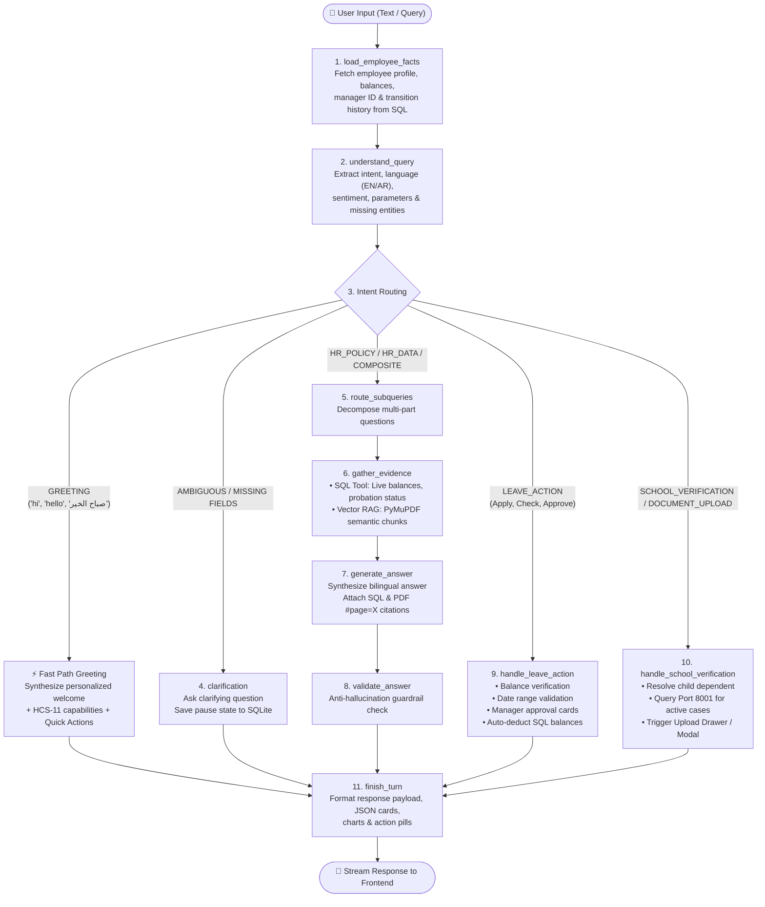
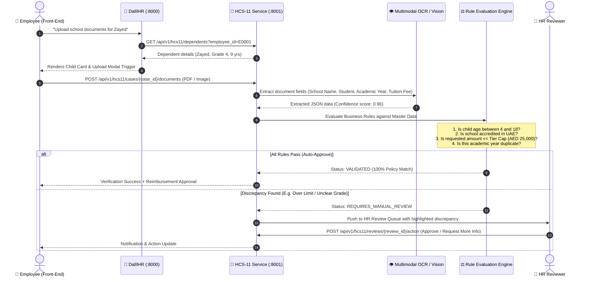

# DalīlHR (HCS-01) & Document Verification (HCS-11) — End-to-End System Workflow

> **Executive Architecture & Backend Workflow Guide**  
> *Prepared for Management, Technical Leads, and System Architects*

---

## 🏛️ 1. High-Level System Architecture

The solution operates as a decoupled, multi-tier enterprise architecture combining **Deterministic Relational Grounding**, **LangGraph Orchestrated RAG**, and an **Autonomous Document AI Verification Microservice**.

```mermaid
graph TB
    subgraph ClientLayer ["1. Frontend Client Layer (Port 8080)"]
        UI["React 18 + TanStack Web UI"]
        Chat["Bilingual Chat Panel"]
        UploadModal["HCS-11 School Document Upload Modal"]
        Notif["Manager Notification & Calendar Center"]
    end

    subgraph HCS01 ["2. DalīlHR Backend Orchestrator (FastAPI : Port 8000)"]
        API_GW["FastAPI API Router (/api/v1/hcs01)"]
        LG["LangGraph Conversational State Machine"]
        SQL_Tool["Deterministic SQL ORM (SQLAlchemy 2.0)"]
        RAG_Tool["Vector RAG Engine (PyMuPDF + Qdrant)"]
        StateDB[("Checkpointer SQLite\n(Conversation Memory)")]
    end

    subgraph HCS11 ["3. School Verification Microservice (FastAPI : Port 8001)"]
        H11_API["HCS-11 FastAPI Router (/api/v1/hcs11)"]
        DocAI["Multimodal Document AI / Vision Extractor"]
        RuleEngine["Deterministic Education Allowance Rule Engine"]
        CaseStore[("HCS-11 Case Store & Master Tables")]
    end

    subgraph DataSources ["4. Grounding Data Sources"]
        OmniDB[("omni_hr.db (SQLite / PostgreSQL)\nEmployee, Leaves, Balances, Hierarchy")]
        PDFStore["Official HR Policy PDF Library\n(Annual Leave, Remote Work, Education)"]
        MasterRef[("Accredited Schools & KHDA/ADEK Fee Tiers")]
    end

    %% Connections
    UI -->|1. REST / SSE Streaming| API_GW
    UploadModal -->|2. Multipart Form Upload| API_GW
    API_GW --> LG
    LG <--> StateDB
    LG --> SQL_Tool
    LG --> RAG_Tool
    SQL_Tool <--> OmniDB
    RAG_Tool <--> PDFStore

    %% Cross-Service Bridge
    LG -->|3. HTTP Client RPC (Port 8001)| H11_API
    API_GW -->|Proxy / Stream| H11_API
    H11_API --> DocAI
    DocAI --> RuleEngine
    RuleEngine <--> MasterRef
    RuleEngine <--> CaseStore
```

---

## 🎯 2. End-to-End Request & LangGraph Workflow

When an employee sends a message in English or Arabic, the **LangGraph State Graph** executes the following sequence of nodes:



---

## 📊 3. Intent Classification & Trigger Matrix

| Intent Category | Triggers & Keywords (EN / AR) | Target LangGraph Node | Backend Engine / Tool | Output Card / Action |
| :--- | :--- | :--- | :--- | :--- |
| **`GREETING`** | `hi`, `hello`, `good morning`, `مرحبا`, `السلام عليكم` | `finish_turn` | FastPath template + SQL employee name | Greeting card with 5 capability bullets + unified Quick Action pills. |
| **`HR_POLICY`** | *“What is the sick leave policy?”*, *“Can I work remotely on Monday?”* | `route_subqueries` ➔ `gather_evidence` ➔ `generate_answer` | Vector RAG (`Qdrant` + `text-embedding-3-large`) | Grounded answer with direct PDF citations (e.g. `[Remote Work Policy, Page 2]`). |
| **`EMPLOYEE_RECORD`** | *“How many leave days do I have?”*, *“Who is my line manager?”* | `gather_evidence` | Deterministic SQL ORM (`omni_hr.db`) | Exact balance pill, manager name, probation status without hallucination. |
| **`COMPOSITE`** | *“Can I take 5 days annual leave given my balance?”* | `route_subqueries` ➔ `gather_evidence` | Hybrid SQL + Policy Vector Match | Cross-referenced rule analysis combining SQL data with policy thresholds. |
| **`LEAVE_ACTION`** | *“I want to apply for annual leave”*, *“Approve leave for Ahmed”* | `handle_leave_action` | SQLAlchemy Leave Service + Workflow Engine | Interactive Calendar Date Picker, Leave Confirmation card, Manager Approval card. |
| **`SCHOOL_VERIFICATION`** | *“School certificate for Zayed”*, *“Education allowance status”*, *“Upload school document”* | `handle_school_verification` | HCS-11 HTTP RPC Client (`http://localhost:8001`) | Child selector pills, active case status card, interactive Document Upload Modal. |
| **`OUT_OF_SCOPE`** | *“Write Python code”*, *“Who won the match?”* | `finish_turn` | Deterministic Abstain Guardrail | Polite refusal directing user strictly to HR-related services. |

---

## 🔍 4. HCS-11 Document Verification Deep Dive

HCS-11 operates on **Port 8001** as an autonomous compliance engine for Proof-of-Schooling claims.



---

## 🔄 5. Integration Architecture: How HCS-01 & HCS-11 Communicate

1. **Decoupled Deployment**:
   - Both services can be deployed on separate containers/VMs or run locally on distinct ports (`8000` vs `8001`).
2. **Asynchronous HTTP Client**:
   - DalīlHR uses `app.integrations.hcs11_client.HCS11Client` with persistent connection pooling, retries, and fallback gracefulness.
3. **Synthetic Identifier Resolution**:
   - `HCS01_TO_HCS11_EMP_MAP` automatically bridges HCS-01 IDs (`EMP011`) to HCS-11 Dependent profiles (`E0011`).
4. **Interactive Action Payloads**:
   - When HCS-11 requires documents, HCS-01 injects an `action_payload` (`SCHOOL_DOCUMENT_SUBMISSION`) which the React frontend interprets to trigger native UI components.

---

## 🛠️ 6. Service Execution Cheat Sheet

| Action | Command / Batch Script | Target Endpoint |
| :--- | :--- | :--- |
| **Run All 3 Together** | `.\start_all.bat` | [http://localhost:8080](http://localhost:8080) |
| **Run Only HCS-01 (Concierge)** | `.\start_backend.bat` | [http://localhost:8000/docs](http://localhost:8000/docs) |
| **Run Only HCS-11 (Verification)** | `.\start_hcs11_backend.bat` | [http://localhost:8001/docs](http://localhost:8001/docs) |
| **Run Only Frontend** | `.\start_frontend.bat` | [http://localhost:8080](http://localhost:8080) |

---
*Generated by DalīlHR Architecture Team — Inception42*
